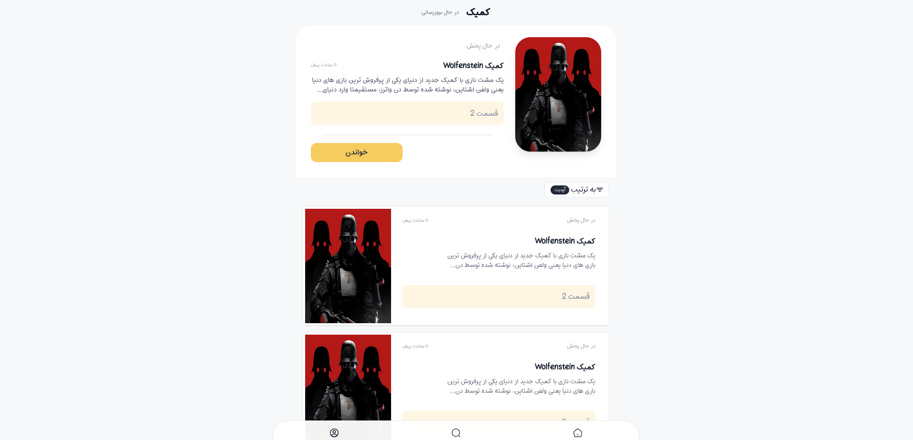

# Comic Website
## General Information
- A simple comic website written in Go (And in Persian)
- I don't have credit for front-end of site

## Screenshot
- A general view

## Technologies Used
- Go v1.18
- HTML,CSS
- MySQL

## Project Status
- Project is: __almost_complete__

## Contact
- Created by [Pouria Khakpour](https://github.com/0ne-zero) - feel free to contact me!
- You can reach me by pouria.khakpour9909@gmail.com
